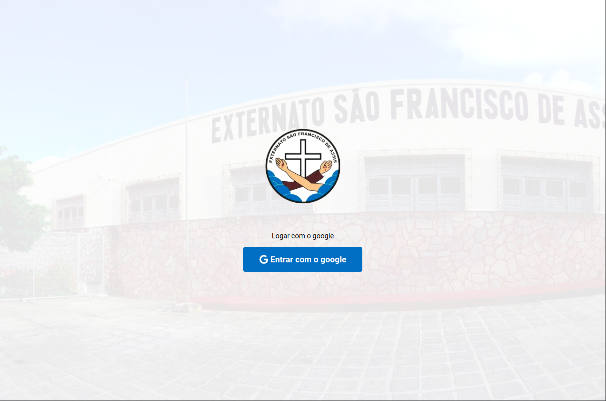
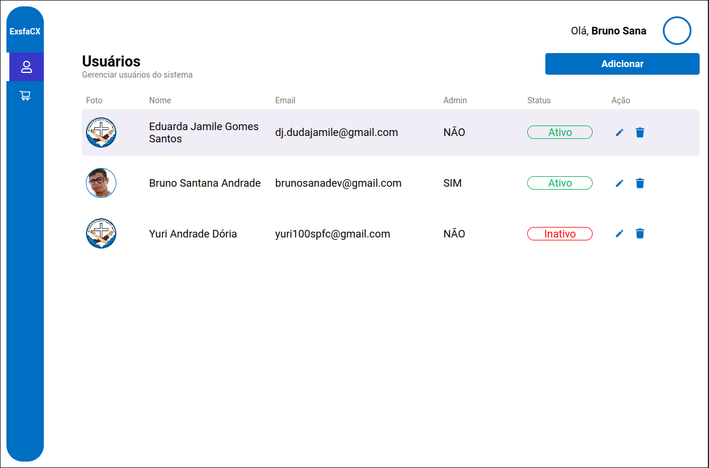
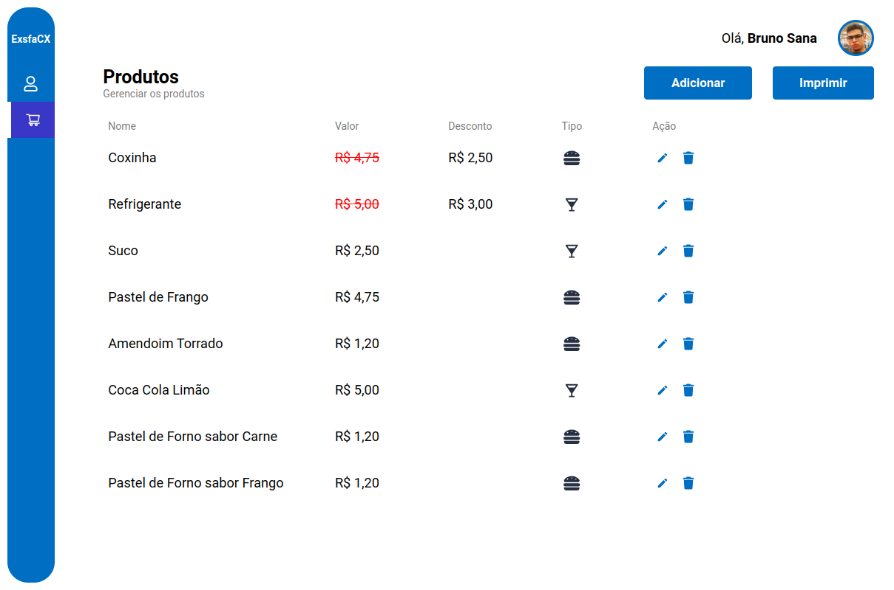
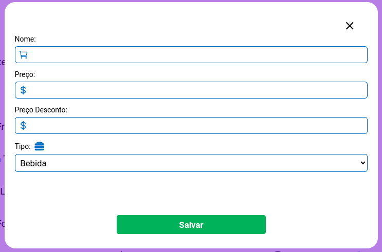
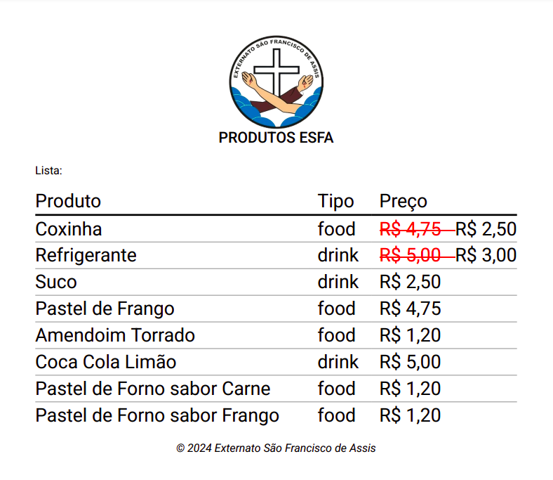

# Esfa CX Web

> Externato São Francisto de Assis Caixa é um sistema Web para gerenciar usuários e produtos do APP EsfaCX.

## Executando o projeto

1. Instlar as dependências com `yarn`
2. Adicionar as envs necessárias no arquivo `.env.local`:
```
GOOGLE_AUTH_CLIENTID=<id_do_firebase>
GOOGLE_AUTH_APP_ID=<firebase_app_id>
GOOGLE_AUTH_PROJECT_ID=<gcp_project_id>

NEXT_PUBLIC_ESFA_API_URL=<esfa_backend_url>
NEXT_PUBLIC_ESFA_API_TOKEN=<esfa_api_token>
```
PS: Para verificar as keys do google:
```
https://console.firebase.google.com/u/0/project/<project-id>/settings/general/<app>?hl=pt
```
3. Executar o projeto local com `yarn dev`

## Previews

### Login
;

### Lista de Usuários
;

### Lista de Produtos
;

### Criar Produto
;

### Cupom Impresso
;